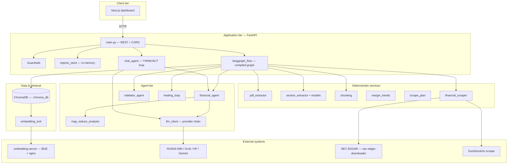
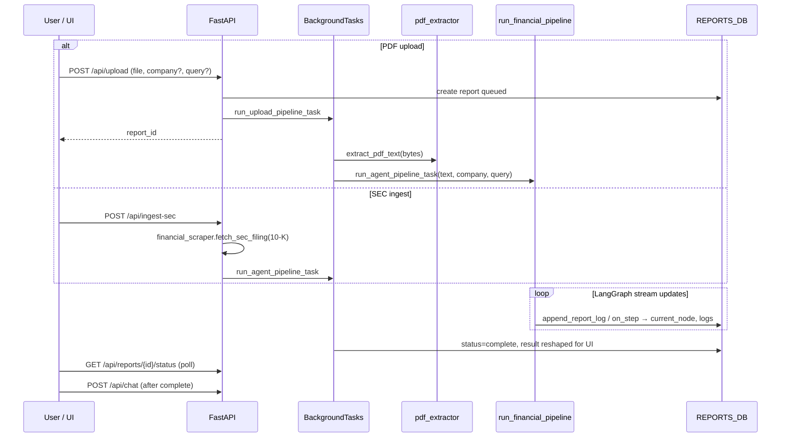
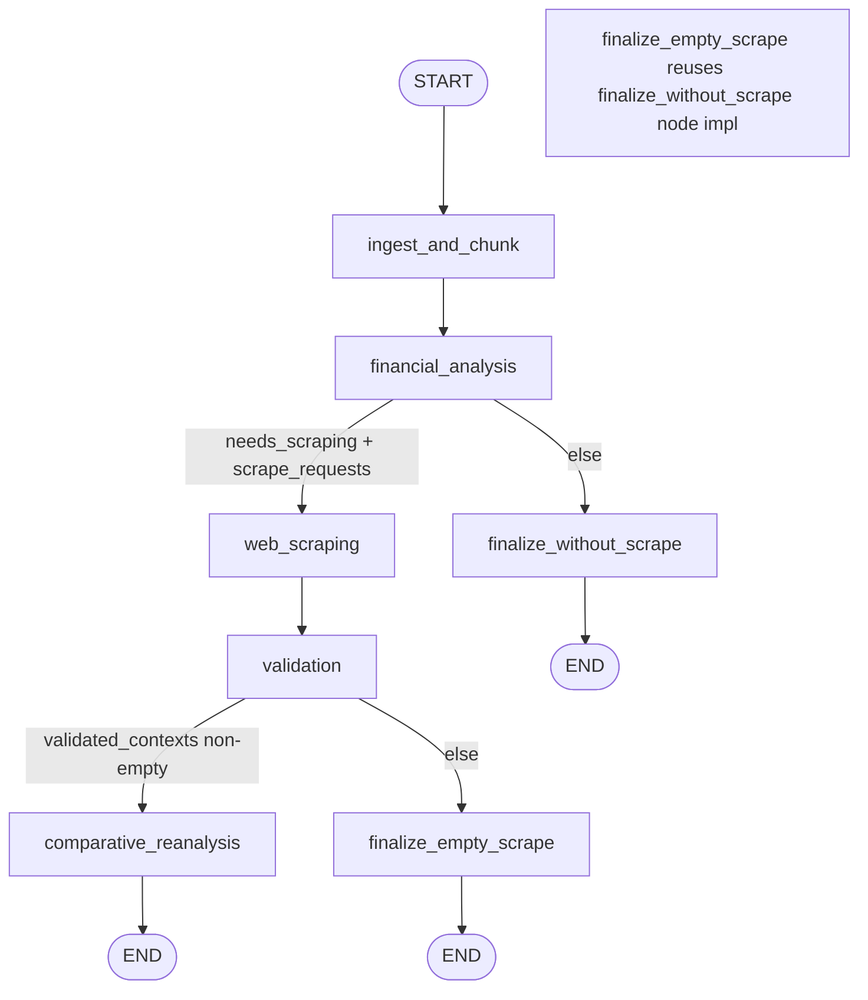
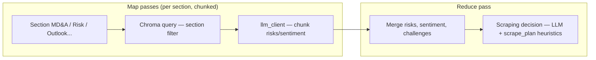
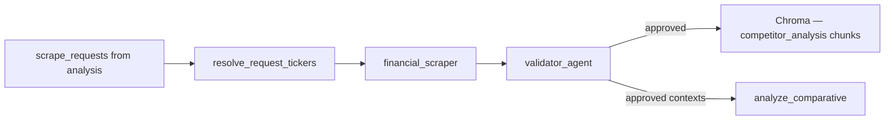
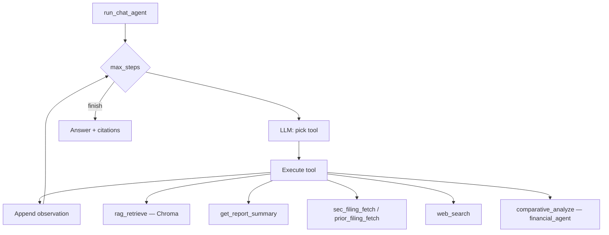

# Aegis — High-Level Design (HLD)

Financial filing intelligence platform: ingest 10-K/10-Q PDFs (or SEC EDGAR text), run a **LangGraph** orchestrated pipeline for risk/sentiment/comparative analysis, index narrative chunks in **ChromaDB**, and serve results plus a **tool-using RAG chat** via FastAPI and Next.js.

---

## 1. System context



| Boundary | Responsibility |
|----------|----------------|
| **Client** | Upload PDF, poll report status, render risks/sentiment/comparative charts, chat with citations |
| **API** | Auth-less hackathon API; guardrails on upload query + chat; background tasks for long pipelines |
| **LangGraph** | Single compiled `StateGraph` — sequential ingest → analysis → optional scrape branch |
| **Agents** | LLM JSON tasks + heuristics fallback; self-heal retries on bad tool/JSON output |
| **Vector store** | Per-report chunks keyed by `company`, `section`, `section_title` |
| **Embeddings** | Remote `POST /embed` or deterministic mock vectors for local dev |

---

## 2. End-to-end system pipeline

Two entry paths converge on the same LangGraph worker.



### 2.1 Upload / ingest stages (outside the graph)

| Stage | Module | Output |
|-------|--------|--------|
| Guardrails | `guardrails.check_upload_query` | Block or sanitize `user_query` |
| PDF text | `ingestion/pdf_extractor` | `raw_text` string |
| Report record | `reports_store.REPORTS_DB` | `queued` → `processing` → `complete` / `failed` |
| Graph invoke | `graph/langgraph_flow.run_financial_pipeline` | Final `AgentState` dict |
| Result reshape | `main.run_agent_pipeline_task` | Flat `result` for frontend (risks, sentiment, sections, comparative, margin_trends) |

Re-trigger: `POST /api/reports/trigger` reuses stored `raw_text` with a new query and runs `run_agent_pipeline_task` again.

---

## 3. LangGraph architecture

**Source:** `backend/graph/langgraph_flow.py`  
**Compiled graph:** `financial_graph = build_financial_intelligence_graph()`

### 3.1 Graph topology



| Router | Function | Condition |
|--------|----------|-----------|
| After `financial_analysis` | `router_should_scrape` | `needs_scraping` **and** non-empty `scrape_requests` → scrape; else finalize |
| After `validation` | `router_after_validation` | Any approved `validated_contexts` → comparative; else finalize (empty scrape branch) |

### 3.2 Node responsibilities

| Node | Type | Primary work |
|------|------|----------------|
| **ingest_and_chunk** | Deterministic + vector | `discover_sections(raw_text)` → catalog + text map; budgeted `split_text_into_chunks` per section; `chromadb_manager.add_chunks` with metadata |
| **financial_analysis** | Agent + heal | `financial_agent.analyze_filing_from_sections` → **map-reduce** (`map_reduce_analysis`); sets `needs_scraping`, `scrape_requests`, `original_analysis`; `run_analysis_with_healing` |
| **web_scraping** | Tools + heal | `resolve_request_tickers` → `financial_scraper.execute_scrape_request` per plan; `run_scrape_with_healing` |
| **validation** | Agent | `validator_agent.validate_scraped_content` per doc; approved text re-chunked into Chroma as `competitor_analysis` |
| **comparative_reanalysis** | Agent + heal | `financial_agent.analyze_comparative` with validated contexts; `compute_margin_trends`; `run_comparative_with_healing` |
| **finalize_without_scrape** | Synthesis | `_build_finalize_analysis` from `original_analysis` only + margin trends |
| **finalize_empty_scrape** | Same handler | Same as finalize when validation rejects all scrapes |

### 3.3 AgentState (shared graph memory)

```text
AgentState (TypedDict, partial updates per node)
├── Inputs: company_name, raw_text, user_query, report_id
├── Ingest: sections, section_catalog, chunks_indexed, rag_context_snippets
├── Analysis: original_analysis, needs_scraping, scraping_reason, targets, scrape_requests, heal_logs
├── Enrichment: scraped_documents, validated_contexts
├── Output: final_comparative_analysis, margin_trends
└── Telemetry: current_step, logs[]
```

Streaming: `financial_graph.stream(initial_state, stream_mode="updates")` merges node patches; `on_step` callback drives live UI via `main._apply_langgraph_step`.

---

## 4. Map-reduce analysis (inside `financial_analysis`)

Not a separate LangGraph node — invoked by `FinancialAgent.analyze_filing_from_sections`.



- **Section discovery:** regex/heading-driven `section_extractor.discover_sections` → `FilingSection` list with priority (MD&A highest).
- **Indexing (ingest node):** weighted chunk budget (`max_chunks_per_filing`, `max_chunks_per_section`).
- **Map:** `map_analyze_chunk` — optional RAG from Chroma for same `company` + `section`.
- **Reduce:** aggregate risks, sentiment score, executive summary, `needs_scraping` / `scrape_requests` (SEC 10-K/10-Q, prior filing, or `web_search`).

Shape enforcement: `_ensure_analysis_shape` + heuristics if LLM JSON is incomplete.

---

## 5. Enrichment branch (scrape → validate → compare)



**Scraper capabilities** (`tools/scraper.py`): SEC filing download, prior-year filing, DuckDuckGo HTML extraction.

**Validator checks:** company match, filing type, freshness, relevance; outputs `cleaned_content` or rejection reason.

**Healing loop** (`agents/healing_loop.py`): On scrape/analysis/comparative failure or invalid JSON, LLM revises plan and retries up to `max_heal_attempts`.

**Margin trends** (`extraction/margin_trends.py`): Deterministic parse of gross margin from SEC excerpts + uploaded text; peer resolved from validated context or user query (`extract_peer_companies`).

---

## 6. LLM & embedding layer

### 6.1 LLM provider chain

`agents/llm_client.py` — ordered fallback (config-driven):

1. NVIDIA NIM  
2. Grok (xAI)  
3. Hugging Face Inference  
4. Gemini  

Roles/prompts: `agents/slm_system_prompts.py` (`SlmRole`, `compose_slm_prompt`). JSON generation used for analysis, scrape planning, validation, chat tool selection.

### 6.2 Embeddings & Chroma

| Component | Role |
|-----------|------|
| `tools/embedding_tool.py` | Batch embed via remote service or `get_mock_embedding` |
| `tools/chroma_tool.py` | Persistent collection; add/query with metadata filters |
| `embedding-server/` | Optional Docker: BGE model + nginx `:8088` |

Chroma metadata schema (typical): `{ company, section, section_title, chunk_index }`.

---

## 7. Post-pipeline: RAG chat (parallel architecture)

Chat is **not** part of the LangGraph graph; it runs synchronously on `POST /api/chat`.



- Guardrails: `check_chat_message` before agent loop.
- Citations: `rag/citation_sources.py` maps chunks and scraped contexts to UI citation objects.
- Comparison formatting: `rag/chat_comparison.py`.

---

## 8. Deployment topology (logical)

```text
┌─────────────────────┐     ┌──────────────────────────┐
│  Next.js frontend   │────▶│  FastAPI (EC2 / local)    │
│  :3000              │     │  backend.main :8000       │
└─────────────────────┘     └───────────┬──────────────┘
                                        │
                    ┌───────────────────┼───────────────────┐
                    ▼                   ▼                   ▼
            ┌──────────────┐   ┌──────────────┐   ┌──────────────┐
            │ ChromaDB     │   │ embedding-   │   │ Cloud LLM    │
            │ ./chroma_db  │   │ server:8088  │   │ APIs         │
            └──────────────┘   └──────────────┘   └──────────────┘
                                        │
                                        ▼
                               ┌──────────────┐
                               │ SEC EDGAR +  │
                               │ Web scrape   │
                               └──────────────┘
```

Environment knobs (`backend/config.py`): chunk budgets, heal attempts, embedding URL/API key, CORS, guardrails flag, map chunk size, max map passes.

---

## 9. API surface (pipeline-related)

| Method | Path | Pipeline role |
|--------|------|----------------|
| `POST` | `/api/upload` | Queue PDF → extract → LangGraph |
| `POST` | `/api/ingest-sec` | SEC 10-K text → LangGraph |
| `GET` | `/api/reports/{id}/status` | Poll `current_step`, `logs`, `current_node` |
| `POST` | `/api/reports/trigger` | Re-run graph with new `user_query` |
| `POST` | `/api/chat` | Tool-loop RAG on completed report |

---

## 10. Key design decisions

| Decision | Rationale |
|----------|-----------|
| LangGraph for filing pipeline only | Clear stages, conditional scrape branch, stream hooks for UX; chat needs flexible multi-tool turns |
| Ingest before agents | Ensures Chroma is populated before map-reduce RAG queries |
| Validator gate before comparative | Prevents peer noise from polluting benchmarks; rejected docs never indexed |
| Self-healing wrappers | SEC ticker mistakes and malformed LLM JSON are common; bounded retries cheaper than hard fail |
| In-memory `REPORTS_DB` | Hackathon simplicity; production would swap for Postgres/S3 without changing graph contract |
| Heuristic fallbacks | Analysis still returns structured risks/sentiment if all LLM providers fail |

---

## 11. Module map (quick reference)

```text
backend/
├── main.py                 # HTTP, background workers, result reshape
├── graph/langgraph_flow.py # StateGraph, nodes, routers, run_financial_pipeline
├── agents/
│   ├── financial_agent.py  # RAG tool, map-reduce entry, comparative SLM
│   ├── map_reduce_analysis.py
│   ├── validator_agent.py
│   ├── healing_loop.py
│   └── llm_client.py
├── extraction/             # sections, margin_trends, narrative_format
├── ingestion/pdf_extractor.py
├── rag/                    # chunking, retrieval, chat_agent, citations
├── tools/                  # chroma, embedding, scraper, scrape_plan
├── guardrails/
└── reports_store.py
```

---

## 12. Failure modes

| Failure | Behavior |
|---------|----------|
| PDF extraction &lt; 100 chars | Upload task fails; report `failed` |
| Section extraction empty | `SectionExtractionError` in `financial_analysis` |
| All scrapes fail | `validated_contexts` empty → finalize branch (local analysis only) |
| LLM unavailable | Heuristics in `analysis_heuristics`; scrape plan from `build_heuristic_scrape_requests` |
| Embedding service down | Depends on config — mock embeddings or startup preload errors logged |

---

*Generated from codebase structure — align with `backend/graph/langgraph_flow.py` and `backend/main.py` when implementing changes.*
